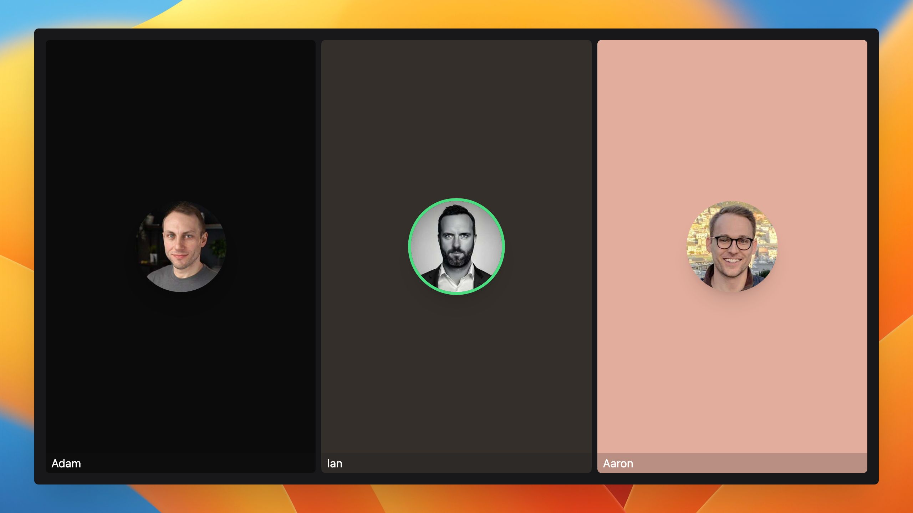

# Speaker scene

This project generates a video from a podcast episode with code. The video displays a grid with the speakers, and their profile picture is highlighted when they talk.



## Set up

Install the dependencies:

```bash
npm install
```

Start Remotion's development server:

```bash
npm start
```

## Ressources

- [The episode of the Mostly Technical podcast used as an example](https://www.youtube.com/watch?v=XYjH_oQ3llg)
- [Watch me build the project on YouTube](https://youtu.be/EGxBBL91nRM)
- [The AI model used to diarize the speakers](https://replicate.com/collectiveai-team/speaker-diarization-3)
